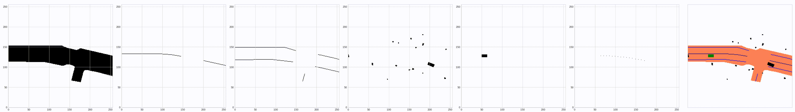
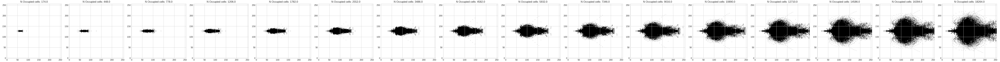
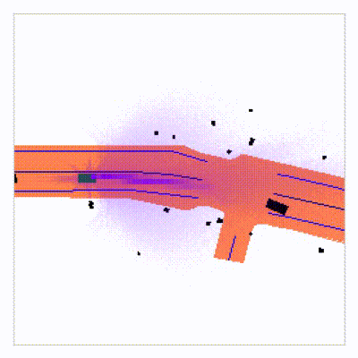
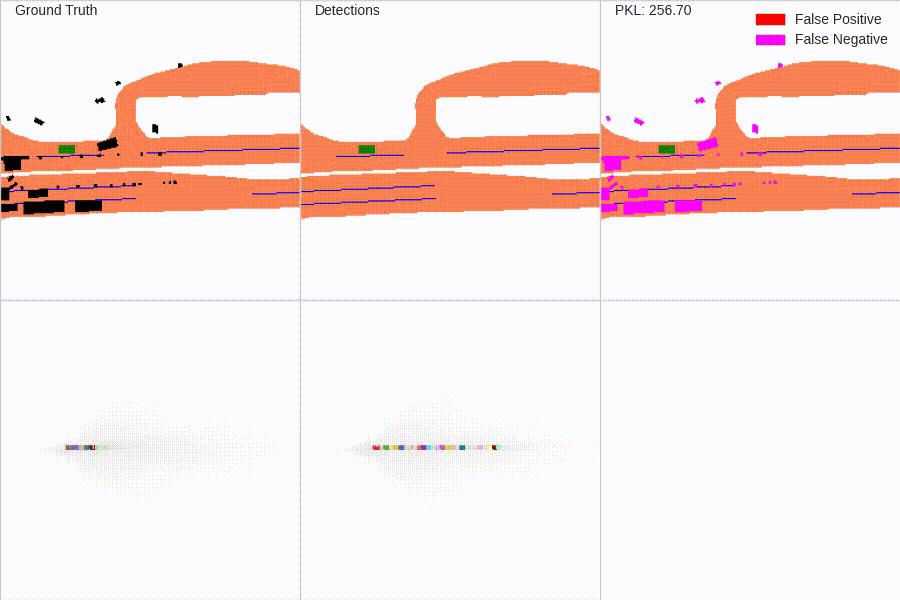
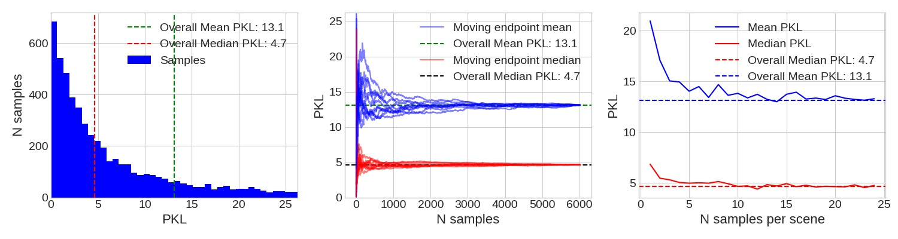
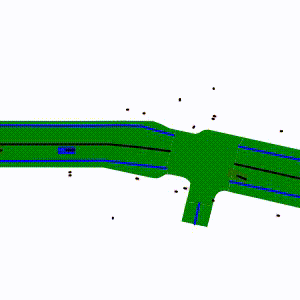
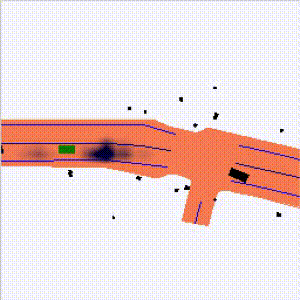

# Learning to Evaluate Perception Models Using Planner-Centric Metrics

PyTorch code for PKL (CVPR 2020).

**Learning to Evaluate Perception Models Using Planner-Centric Metrics**  
Jonah Philion, [Amlan Kar](http://www.cs.toronto.edu/~amlan/), [Sanja Fidler](http://www.cs.toronto.edu/~fidler/)\
CVPR, 2020 (Poster)\
**[[Paper](https://arxiv.org/abs/2004.08745)] [[Project Page](https://nv-tlabs.github.io/detection-relevance/)]**

**Abstract:**
Variants of accuracy and precision are the gold-standard by which the computer vision community measures progress of perception algorithms. One reason for the ubiquity of these metrics is that they are largely task-agnostic; we in general seek to detect zero false negatives or positives. The downside of these metrics is that, at worst, they penalize all incorrect detections equally without conditioning on the task or scene, and at best, heuristics need to be chosen to ensure that different mistakes count differently. In this paper, we propose a principled metric for 3D object detection specifically for the task of self-driving. The core idea behind our metric is to isolate the task of object detection and measure the impact the produced detections would induce on the downstream task of driving. Without hand-designing it to, we find that our metric penalizes many of the mistakes that other metrics penalize by design. In addition, our metric downweighs detections based on additional factors such as distance from a detection to the ego car and the speed of the detection in intuitive ways that other detection metrics do not. For human evaluation, we generate scenes in which standard metrics and our metric disagree and find that humans side with our metric 79% of the time.

**Note:** This repository builds on the [nuscenes-devkit library](https://github.com/nutonomy/nuscenes-devkit/blob/master/LICENSE.txt) which also uses the Apache 2.0 License.

### Citation
If you found this codebase useful in your research, please consider citing
```
@InProceedings{Philion_2020_CVPR,
author = {Philion, Jonah and Kar, Amlan and Fidler, Sanja},
title = {Learning to Evaluate Perception Models Using Planner-Centric Metrics},
booktitle = {Proceedings of the IEEE/CVF Conference on Computer Vision and Pattern Recognition (CVPR)},
month = {June},
year = {2020}
}
```

## Quick Start

We show how to evaluate PKL for a synthetic detection submission using a pretrained planner. Instructions for training models yourself can be found in the "Full Tutorial" section. We assume that [nuScenes](https://www.nuscenes.org/download) is located at `NUSCENES_ROOT` and nuScenes maps are located at `NUSCENES_MAP_ROOT`.

Install the `planning-centric-metrics` package (or install locally with `pip install -e .`).

```
pip install planning-centric-metrics
```

The `planning-centric-metrics` package has one exposed function (`calculate_pkl`) and the API is shown below.

```
nusc_eval = DetectionEval(nusc, config=cfg,
                          result_path='./example_submission.json',
                          eval_set='mini_train',
                          output_dir='./res', verbose=True)
info = planning_centric_metrics.calculate_pkl(nusc_eval.gt_boxes, nusc_eval.pred_boxes,
                                              nusc_eval.sample_tokens, nusc_eval.nusc,
                                              nusc_maps, device,
                                              nworkers, bsz=128,
                                              plot_kextremes=5,
                                              verbose=True)
```
An example script that uses the `planning_centric_metrics` package to calculate the PKL for a synthetic detector can be found in `examples/synthetic.py`. Set `--gpuid=-1` to use the CPU.
```
python examples/synthetic.py quick_test --dataroot=NUSCENES_ROOT --map_folder=NUSCENES_MAP_ROOT --gpuid=0 --nworkers=10

-> {'min': tensor(0.2776), 'max': tensor(256.7013), 'mean': tensor(54.6309), 'median': tensor(13.1194), 'std': tensor(71.5134)}
```

## Full Tutorial

### Preparation
Download nuscenes data and maps from [https://www.nuscenes.org/](https://www.nuscenes.org/).

Install dependencies.

```
pip install nuscenes-devkit tensorboardY
```

### (optional) Visualize the data
Visualization of inputs and outputs of the "planner".

```
python main.py viz_data mini --dataroot=NUSCENES_ROOT --map_folder=NUSCENES_MAP_ROOT
```


### Generate masks
Determine the locations where a car can exist after dt seconds from data. These masks are used both during training and during PKL calculation.

```
python main.py scrape_masks trainval --dataroot=NUSCENES_ROOT --map_folder=NUSCENES_MAP_ROOT
```

Visualize the masks.

```
python main.py viz_masks --out_name=masks.json --imname=masks.jpg
```


### Train a planner
Eval accuracy generally peaks after 100k steps (~24 hours to train on a Titan V).

```
python main.py train trainval --ego_only=False --flip_aug=True --lr=0.002 --weight_decay=1e-08  --logdir=./runs --dataroot=NUSCENES_ROOT --map_folder=NUSCENES_MAP_ROOT --num_workers=NWORKERS --mask_json=masks.json
```
Monitor tensorboard if you'd like to.

```
tensorboard --logdir=./runs --bind_all
```
Visualize the predictions of a model.

```
python main.py eval_viz mini --modelpath=MODELPATH --dataroot=NUSCENES_ROOT --map_folder=NUSCENES_MAP_ROOT
```


### Generate a "submission"
To demonstrate how to evaluate PKL, we first generate a synthetic detection submission. For instance, generate a submission that drops detections 0% of the time (a perfect submission)

```
python main.py generate_drop_noise mini mini_train --drop_p=0.0 --dataroot=NUSCENES_ROOT
```

...or generate a submission that drops all detections.

```
python main.py generate_drop_noise mini mini_train --drop_p=1.0 --dataroot=NUSCENES_ROOT
```

### Score a submission with PKL
Score the synthetic submissions generated above. For `drop_p=0.0` the PKL should be 0 no matter what planner is used. For `drop_p=1.0` on the `mini_train` split using the pre-trained planner, the mean PKL should be 54.6310.

```
python main.py eval_test mini mini_train --result_path=SUBMISSION --dataroot=NUSCENES_ROOT --map_folder=NUSCENES_MAP_ROOT --modelpath=MODELPATH --plot_kextremes=5
```

For `drop_p=1.0`, the 5 timestamps with the highest PKL (high is bad) under the pre-trained planner are shown below.



### PKL Distribution
Analyze the distribution of PKL values for a given submission. Image shown below analyzes the PKL of [MEGVII val detections](https://github.com/poodarchu/Det3D/tree/master/examples/cbgs).

```
python main.py pkl_distribution_plot trainval --pkl_result_path=SUBMISSION --dataroot=NUSCENES_ROOT
```


### (optional) Sensitivity visualization
To investigate what PKL is sensitive to, visualize the importance of each ground-truth object by removing it from the scene and computing the PKL.

```
python main.py false_neg_viz mini --modelpath=MODELPATH --dataroot=NUSCENES_ROOT --map_folder=NUSCENES_MAP_ROOT
```



Visualize the importance of correctly not predicting a false positive at each location in a grid about the ego.

```
python main.py false_pos_viz mini --modelpath=MODELPATH --dataroot=NUSCENES_ROOT --map_folder=NUSCENES_MAP_ROOT
```



### Acknowledgements
Thank you to Amlan Kar, Sanja Fidler, Karan Sapra, the NVIDIA AV Team, and NVIDIA Research for their help in making this research possible.
